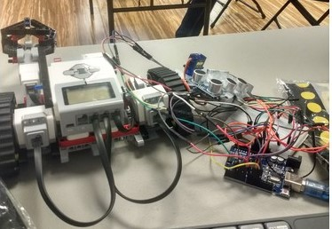

# Clever Rover HackPHSII

## Summary
Remotely controls a EV3 robot by using “hand signals”. An arduino along with several ultrasonic sensors are setup in order to “read” hand signals given by the operator. These hand signals are sent to a computer over serial which in turn remotely controls the EV3 over wifi.

## Demo
Find more project description on devpost: https://devpost.com/software/clever-rover

## Getting Started
Download and open in Android Studio